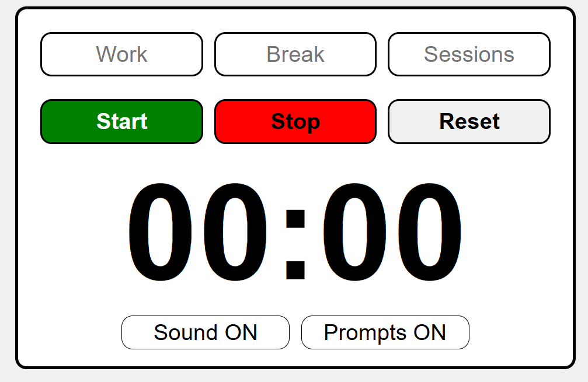

Simple pomodoro timer for work

Toy project to help learn HTML, CSS and simple JS

uses gh-pages to run src folder in pages
Need to install gh-pages package to allow us to publish hte src folder

Can also be instaled as an electron application
Need to install electron
To create application (run in terminal):
"npx electron-packager . APPNAME --platform=win32 --arch=x64 --icon=path/to/icon.ico"